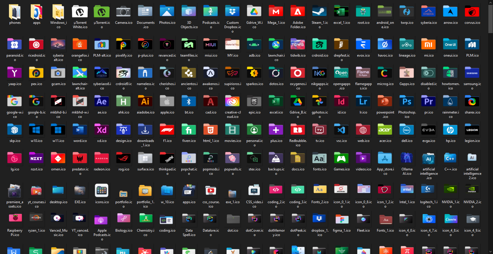
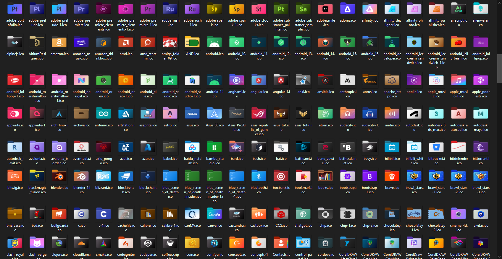
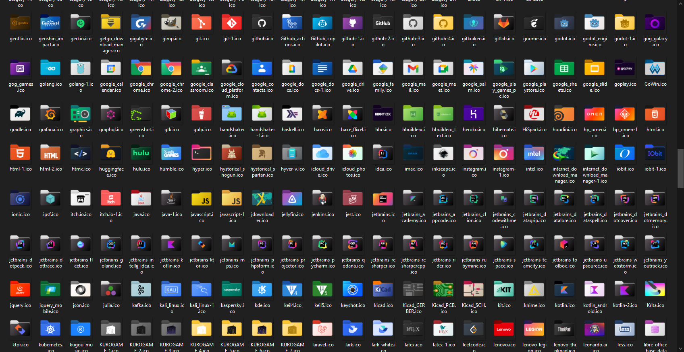
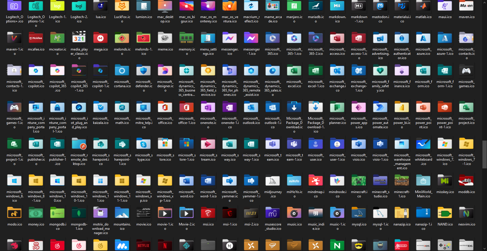
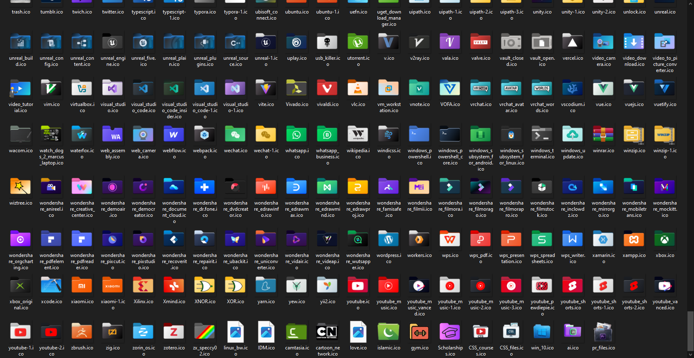

# icons-pack
 
A collection of `.ico` icons (64x64).
 
## Contents
 
- `.ico` files (64x64)

## Stats

Total icons: 1618

- `ico/`: 1550
- `ico/apps/`: 3
- `ico/Windows_ico/`: 43
- `ico/phones/`: 22

## Attribution

These icons are collected from the Folder11 community icon repositories.

- Source: https://github.com/icon11-community/Folder-Ico
- Related project: https://github.com/icon11-community/Folder11

All rights belong to their respective owners. This repository only re-hosts the icons for convenience.

## Notes
 
- `.ico` is best-supported on Windows.
- On Linux, support depends on the desktop environment/app. If you need broad compatibility, consider adding PNG exports alongside the `.ico` files.

## Previews
 

 
 
 

 
 
 

 
 
 

 
 
 

